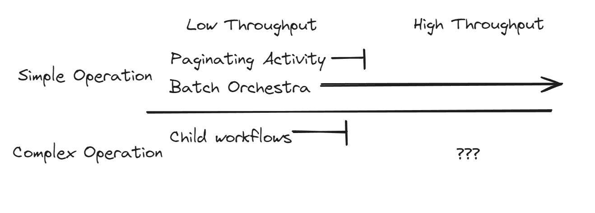
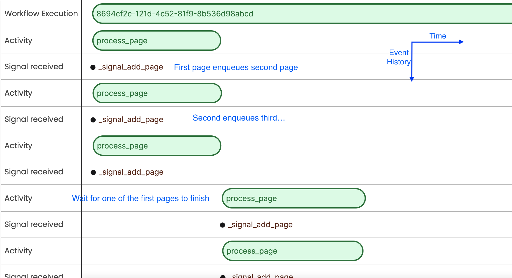
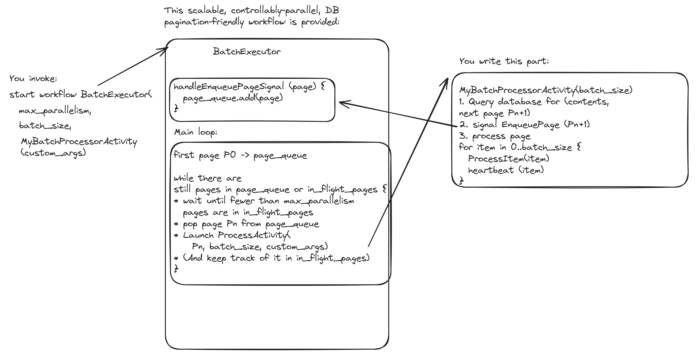

# Batch Orchestra

Batch Orchestra is an easy-to-use library for reliably and scalably performing many like operations such as DB migrations and periodic batch jobs.
It solves many problems for these scenarios, such as controllably parallel execution, fair pagination.  See a full list of features below.

All you have to build is a page processor to process an individual page, and optionally a custom progress tracker.

In python, for example, that your page processor look something like this:

    @page_processor
    class InflateProductPrices(PageProcessor):

        async def run(self, context: BatchProcessorContext):
            page = context.page
            cursor = ProductDBCursor.from_json(page.cursor_str)

            args = ConfigArgs.from_json(context.args_str)
            products, next_cursor = MyDB.query_page(cursor, results=page.size)

            if next_cursor:
                # There's another page to process.  Kick it off.
                await context.enqueue_next_page(
                    BatchPage(next_cursor, page.size)
                )

            # Do your operation on each item in the page
            for product in products:
                # Do some operation -- it should be idempotent if you are retrying
                await product.do_some_operation()

        # Specify whether you want your processor to retry after failures.  Retries are recommended,
        # but you should generally make sure your operations are idempotent.
        @property
        def retry_mode(self) -> PageProcessor.RetryMode:
            return PageProcessor.RetryMode.EXECUTE_AT_LEAST_ONCE

That's it!  There's more customization you can do as well.

The batch is parallelized and tracked using a [Temporal](https://temporal.io) workflow.

# Quick Start

To develop anything using temporal on your machine, first get a [local Temporal server running](https://docs.temporal.io/application-development/foundations#run-a-development-cluster)

Then look at the language-specific quickstart guides:

* [Python](./python/README.md)

# FAQ
## What problems does batch-orchestra help me solve?
It's designed to iterate through a data set (e.g. CSV, database) of any scale and parallel process that data.
Operations should be relatively simple, such as migrating records or calling an API for each item in a data set.

## So, this is based on Temporal.  Why not just use the Temporal SDK directly?
Temporal's SDKs were not built with batching primarily in mind.  
The straightforward patterns are either single-threaded ([Java sample](https://github.com/search?q=repo%3Atemporalio%2Fsamples-java%20HeartbeatingActivityBatchWorkflowImpl&type=code)) or parallel-but-expensive ([Java sample](https://github.com/search?q=repo%3Atemporalio%2Fsamples-java%20IteratorBatchWorkflowImpl&type=code)).
Batch Orchestra is particularly useful for high-scale, low-complexity operations:

It also provides many useful features out of the box that would be too time-consuming for most teams to build themselves.

## What features and benefits does it have?
It helps solve many problems that tend to come up for batch jobs.
* Can run tens or hundreds of processes in parallel.
* Eliminates unevenly-sized pages.
* Only scans through your database one time--no need for an initial pass to find the page boundaries.
* Scales "infinitely"
* Controllable parallelism to limit impact on downstream systems.
* Pauses and gradual throughput rampups.
* Feature-rich retries.
* Built-in progress tracking.
* Debuggable, via Temporal's UI and log statements.
* Rich failure handling:
  * Code deploys can fix your running batch without need for other remediations.
  * Built-in failure and stuck pages tracking.
  * Stuck pages do not block overall progress on other pages.
  * [coming soon] Allows you to avoid head-of-line blocking.

Check out the  to get a better idea.

## Why should I trust this framework?
* It is based on Temporal workflows.  Temporal is known for its feature richness, along with its robustness and distributed systems heavy lifting.
* It's based on a design built within Stripe where it was both robust and popular.

## What types of people will use this framework?
Early, users who already use Temporal or are interested in setting up Temporal for their project will be the most interested.  
It's TBD to what extent this is better than other frameworks outside the Temporal orbit.

## What are the caveats?
Batch Orchestra does not guarantee that items in your data set are processed in a certain order.

Otherwise, think about the operation you want to apply to each item in your data set.
If it's "complex", meaning it's stateful and difficult to make idempotent, you may instead want to run a workflow per operation or, at high throughputs, use other frameworks.

# Approach:
Batch Orchestra uses "pipelined pagination."

## Prior art: parallel pagination
Normally, when you paginate through a data set in parallel, you 
1. determine the page boundaries
2. "fan out" different pages to different workers to execute in parallel
3. Record each time a page completes.
Step 1 is problematic.  How do you know what the page boundaries should be?  If you have a static file with numbered lines, you can easily calculate the pages up front by passing line numbers.  But in the real world, you often need to paginate based on a primary key or timestamp.  You need to either do a full scan of your data set, or make guesses as to how to divide the data, such as processing data in 5 minute time increments and hoping that the data are evenly distributed among time slices.

## Prior art: serial pagination
Normally, when you paginate through a data set serially, in a loop, you 
1. fetch the contents of a page, 
2. process each item
3. calculate the cursor for the next page
4. Record completion through the cursor so that if your process fails, it can resume from where it left off.
This approach is simple but allows no parallelism.

## Pipelined pagination
With Batch Orchestra, you code like you are doing serial pagination, but you invert steps 2 and 3.  The cursor is handed off to the orchestrator to execute in parallel while you process each item.
This gives you the simplicity of serial pagination along with parallelism, fair page sizes, and requires only one scan through the data set.
(P.S. Please let me know if you've seen other frameworks adopt this approach or know of an existing term for it.)

Let's see what a pipelined batch job looks like in Temporal's UI.  This batch job had 3-way parallelism:

If you'd prefer a more code-centric view, the algorithm looks like this:
 

