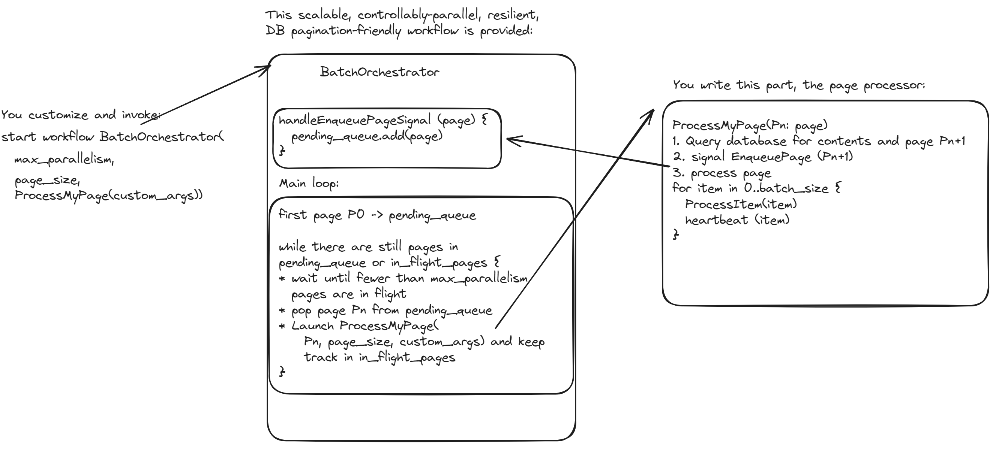

# Temporal Batch

An easy-to-use library for reliably and scalably performing many like operations based on [Temporal](https://temporal.io) workflows and activities.
It supports
* controllably parallel execution across many machines, allowing you to process quickly while limiting how heavily you 
  beat down your downstream dependencies
* pagination.  When you query a database for some results plus the next page token, you
  simply signal the workflow with the next page token before you start processing the results.

All you have to build is an  to process manageable chunks.

# Quick Start

To develop anything using temporal on your machine, first get a [local Temporal server running](https://docs.temporal.io/application-development/foundations#run-a-development-cluster)

Then look at the language-specific quickstart guides:

* [Python](./python/README.md)

# FAQ
## Why should I trust this framework?
* It is a relatively thin veneer on top of Temporal workflows.  Temporal is known for its feature richness, along with scaling and distributed systems heavy lifting.
* It was originally built within Stripe where it was both scalable and popular.

## What problems does it help me solve?
It's designed for iteration through a data set (CSV, database) and parallel processing of that data.  
For example, data migrations, calling an API for each item in a data set.

It solves, or helps you solve, many problems that tend to come up for these cases.
* Can run on tens or hundreds of processes in parallel.
* Eliminates unevenly-sized pages without needing to first traverse the database to find the page boundaries.
* Controllable parallelism to limit impact on downstream systems, including [coming soon] pauses and gradual rampups.
* Retries, allowing designation of non-retryable exceptions.
* Allows the caller to track progress.
* Rich failure handling:
** Code deploys can fix your running batch without need for other remediations.
** It tracks failures for you
** It calls your handler when there are failures.
** [coming soon] Allows you to avoid head-of-line blocking.

Check out the  to get a better idea.

## What types of people will use this framework?
Early, users who already use Temporal or are interested in setting up Temporal for their business will be the most interested.  
Please reach out if have thoughts on how this compares to the state of the art in any given language.

## What are its limitations?
* It doesn't natively support chaining operations together, which limits the complexity of individual operations you'd want to run through this framework.
* It's not designed for big data transformations.  If your input and output are both columnar database tables, this is not for you.

# Architecture:
 

